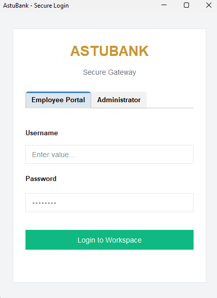
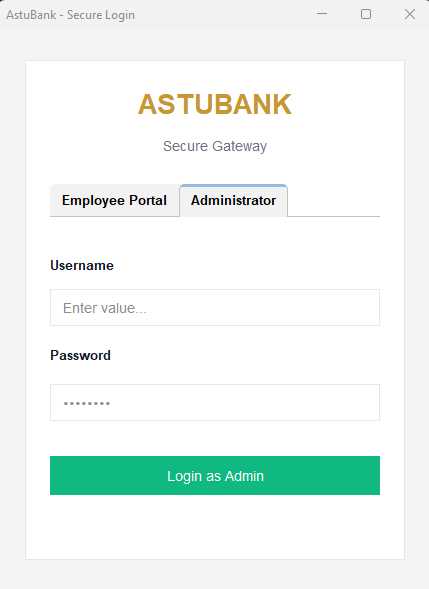
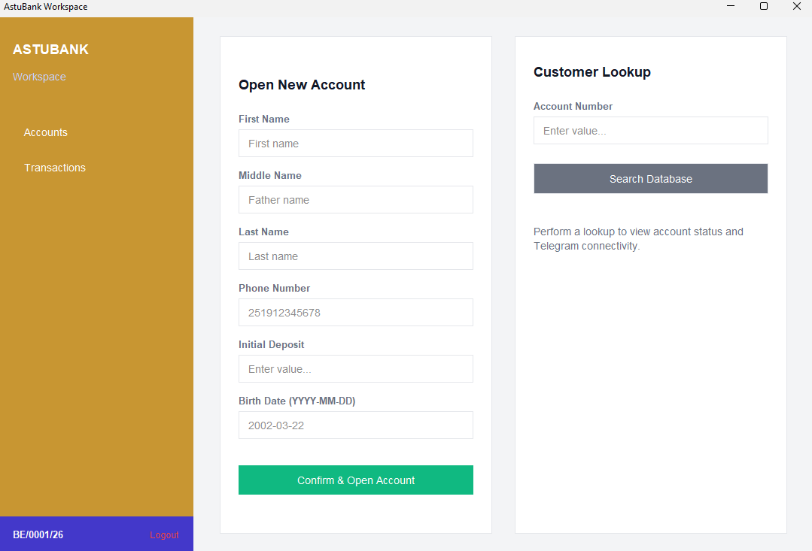
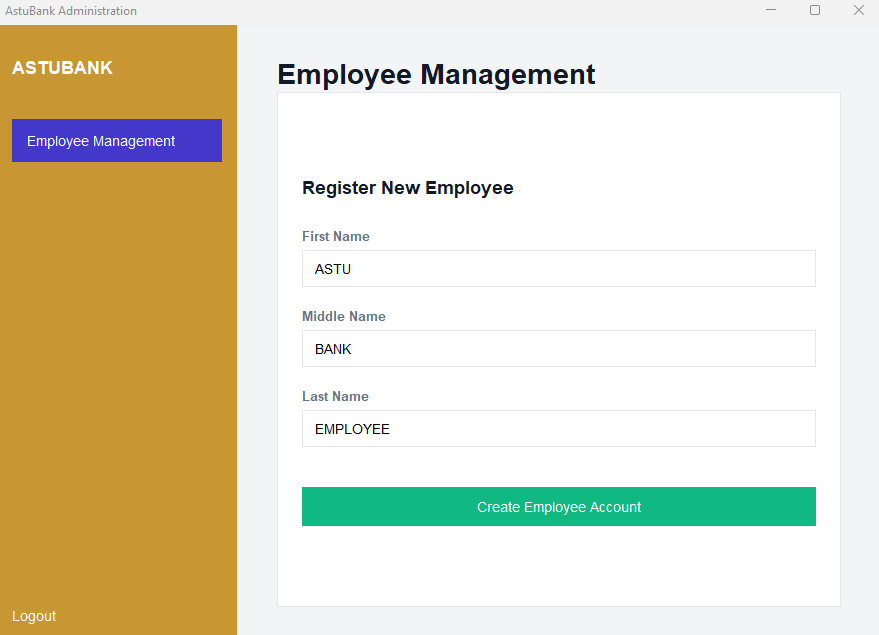
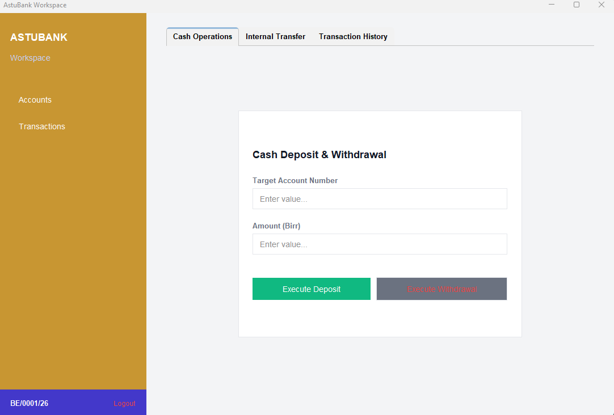
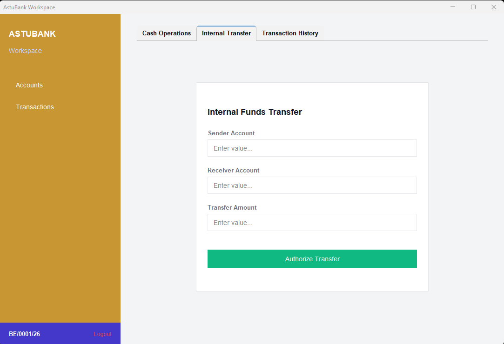
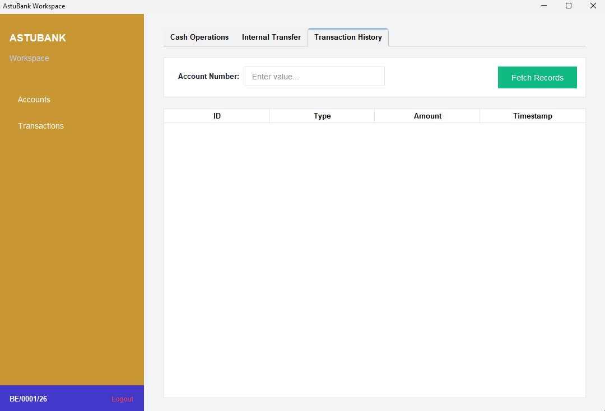

# 🏦 ASTU Bank — Multi-Module Banking System

Welcome to the **ASTU Bank** project! This is a comprehensive banking management system designed with a modern multi-module architecture. 
The project includes a backend API, a Telegram bot for customer interactions, and a professional desktop application for bank administrators and employees.

---

## 📖 Project Overview

ASTU Bank is built to provide a seamless banking experience. It leverages a microservice like architecture within a single repository to ensure modularity and scalability.

### 🏗️ Architecture & Modules

- **`core`**: The heart of the system. A **Spring Boot** application that provides the RESTful API, handles business logic, and manages the PostgreSQL database.
- **`bot`**: A **Telegram Bot** implementation using the Telebof library. It handles user verification (OTP) and account related notifications.
- **`desktop`**: A professional desktop GUI built with **Java Swing** and **FlatLaf**. It allows bank staff to perform operations like account creation, deposits, withdrawals, and transfers.
- **`common`**: A shared module containing Data Transfer Objects (DTOs), constants, and utility classes used by all other modules.

---

## 🛠️ Requirements

To run this project, you only need two primary tools:

- **Java Development Kit (JDK) 21+**: The project uses modern Java 21 features.
- [**Docker**](https://www.docker.com/): Essential for running the database and backend services.

---

## 📥 Getting Started

### 1. Obtain the Source Code

You can get the source code in one of two ways:

**Option A: Using Git (Recommended)**
```bash
git clone https://github.com/natanim/AstuBank.git
cd AstuBank
```

**Option B: Download ZIP**
1. Download the project [ZIP file from the repository.](https://github.com/natanim/AstuBank/releases/tag/v1.0.0)
2. Extract the contents to a folder of your choice.
3. Open your terminal and navigate to the project root:
   ```bash
   cd AstuBank
   ```

### 2. Configuration
The project uses environment variables for sensitive information and module configuration.

| Variable | Module(s) | Description |
| :--- | :--- | :--- |
| `BOT_TOKEN` | `core`, `bot` | The API token for your Telegram Bot (obtain from [@BotFather](https://t.me/botfather)). |

---

## 🚀 How to Run

We provide a `start.sh` script to simplify the startup process across different operating systems.

### 🪟 Windows (Recommended: Git Bash or CMD or WSL)
1. Open **Git Bash** or **WSL**.
2. Set your bot token:
   ```bash
   export BOT_TOKEN=your_telegram_bot_token_here
   ```
3. Run the startup script:
   ```bash
   ./start.sh
   ```

### 🍎 macOS / 🐧 Linux
1. Open your terminal.
2. Grant execution permissions to the script:
   ```bash
   chmod +x start.sh
   ```
3. Set your bot token:
   ```bash
   export BOT_TOKEN=your_telegram_bot_token_here
   ```
4. Start the application:
   ```bash
   ./start.sh
   ```
---

## 📂 Project Structure

```text
AstuBank/
├── bot/             # Telegram Bot (User Interaction)
├── common/          # Shared DTOs and Logic
├── core/            # Spring Boot Backend (API & DB)
├── desktop/         # Java Swing UI (Admin/Employee Tools)
├── docker-compose.yml
├── pom.xml          # Parent Maven Configuration
└── start.sh         # Main Startup Script
```

---

## 🔐 Access & Security

### 🛡️ Administrator Access
The system comes with a default administrator account.
- **Username**: `admin`
- **Password**: `admin`

> [!IMPORTANT]
> You can change the default credentials in `core/src/main/resources/application.yml` under the `app.admin` section.

### 👥 Employee Access
Employees do not have default credentials.
1. An **Administrator** must first create an employee account via the Desktop application or the `/api/admin/create/employee` endpoint.
2. The system will generate a **Username** and **Password** for the new employee.
3. The employee can then use these generated credentials to log in to the system.

---

---

## 📸 Screenshots

|        Employee Login Screen        |          Admin Login Screen          |
|:-----------------------------------:|:------------------------------------:|
|  |  |


### DASHBOARDS
|           Employee Dashboard            |             Admin Dashboard              |
|:---------------------------------------:|:----------------------------------------:|
|  |  |


### Transaction Tab

|      Deposit / Withdraw      |             Transfer              |          Transaction History          |
|:----------------------------:|:---------------------------------:|:-------------------------------------:|
|  |  |  |


---

## 🔌 API Overview

The `core` module exposes a REST API at `http://localhost:8080/api`. Below are the key endpoints:

### 🔐 Authentication
| Method | Endpoint | Description |
| :--- | :--- | :--- |
| `POST` | `/auth/admin/login` | Login as a System Administrator |
| `POST` | `/auth/employee/login` | Login as a Bank Employee |
| `POST` | `/auth/user/login` | User login via OTP |

### 👨‍💼 Management (Admin Only)
| Method | Endpoint | Description |
| :--- | :--- | :--- |
| `POST` | `/admin/create/employee` | Create a new bank employee account |

### 💰 Banking Operations (Employee Only)
| Method | Endpoint | Description |
| :--- | :--- | :--- |
| `POST` | `/e/account/create` | Open a new bank account |
| `GET` | `/e/account/{ac}` | View account details |
| `POST` | `/e/account/deposit` | Deposit funds into an account |
| `POST` | `/e/account/withdraw` | Withdraw funds from an account |
| `POST` | `/e/account/transfer` | Transfer funds between accounts |
| `GET` | `/e/account/{ac}/transactions` | View transaction history |
| `POST` | `/e/account/{ac}/generate/otp` | Send verification OTP via Telegram |

---

*Built with ❤️*
